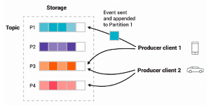
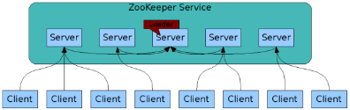

# Kafka
- Pub-sub: publish (write) and subscribe (read) events;
- Kafka's performance does not degrade as the stored data size increases;
- Servers run as clusters of multiple brokers that can span multiple datacenters and regions;
- Clients are libraries provided by the community, available for Java, Scala, Python, Go, and more.
- Producers and consumers are fully decoupled and agnostic of each other, enabling high scalability;
- `bootstrap.servers` only specifies the initial list of servers to connect to, since the discovery
  of the full cluster membership will happen dynamically. You may want to specify more than one
  though, just in case a server is down.
  
## Events
- Each event (message) can be uniquely identified by the tuple (topic, partition, offset) within the
  partition;
- Events are written and read from topics;
- Events with the same key are written to the same partition;
- Events are not deleted consumption, but you can set a retention period per topic;
- Events have:
  - Key
  - Value
  - Timestamp
  - (Optional) headers
  
## Producer
- Producers push messages to the topics;
- Producers write to the partition leader;
- The partition leader is responsible for writing the message to its own in sync replica and 
  propagating the message to other brokers when the message is committed. Each replica acknowledges 
  they received the message and then are called in sync.
- `acks` sets the number of acknowledgements the producer waits for the leader to confirm the 
  received message.
  
## Consumer
- Consumers pull messages from the topics;
- Consumers read committed (written to all in sync replicas) messages from any single partition;
- `group.id` identifies a group of consumers, so each consumer within the group reads from a unique
  partition and the group as a whole consumes all messages from the entire topic.
- If there are more consumers than partitions, then some consumers will be idle;
- If there are more partitions than consumers, then a consumer will read from multiple partitions;
- If there are an equal number of partitions and consumers, then each consumer reads messages in
  order from exactly one partition.
- Kafka stores the offsets of consumers.
- Kafka does NOT guarantee message ordering for the entire topic.

## Topic

- Topics are partitioned, new events are appended to one of the topic's partitions;
- replication-factor is set on topics to achieve fault-tolerance. Productive environments usually 
  have a replication factor of 3. This replication happens at the topic-partition level.
- cleanup.policy designates the retention policy of the messages as "delete", "compact" or "both".

## Consistency and Availability
Guarantees about data consistency and availability when reading and consuming from one partition:
1. Messages sent to a topic partition will be appended to the commit log in the order they are sent;
2. A single consumer instance will see messages in the order they appear in the log;
3. A message is "committed" when all in sync replicas have applied it to their log;
4. Any committed message will not be lost, as long as at least one in sync replica is alive.

### Consistency as producer
- If the replicas go offline and fall behind the leader on the messages (out of sync), messages
  available in the original leader that have not been replicated, will be lost if one of the behind
  replicas is elected as the new leader. This reduces downtime but loses data.
- If a leader goes offline whilst having in sync replicas, one of the replicas will become leader
  and no data will be lost. This may take a few seconds and result in "LEADER_NOT_AVAILABLE" errors
  from the client.
  
### Consistency as consumer
There are three levels of consistency for receiving each message. *At least once* is preferred.
- *At most once*: the consumer reads, commit the message and then processes it.
  However, if the consumer crashes between committing the offset and processing the message, the
  message will not be read again;
- **At least once**: the consumer reads, processes the message, then commits it. This means that if 
  the consumer crashes between reading and committing the message, it will have the chance to 
  process it again. This could lead to message duplication in downstream systems but no data loss.
- *Exactly once*: the consumer reads, processes and commits the message with the offset to a
  transactional system. If the consumer crashes, it can re-read the last transaction committed and
  resume processing. This leads to no data duplication but significant decrease of throughput.

# ZooKeeper

- Centralised coordination service for distributing configuration, naming and providing group 
  services.
- ZooKeeper keeps track of the Kafka brokers, topics and partitions;
- Maintains a real-time list of all Kafka brokers that are part of the cluster;
- Maintains topic configuration, such as:
  - List of existing topics;
  - Number of partitions of a given topic;
  - Location of the replicas;
  - Configuration overrides for all topics;
  - The preferred leader;
  - etc.

# Kafka Connect
Integrates Kafka with databases, key-value stores, search indexes and file systems, by providing two 
types of connectors:
- Source connector: ingests databases and streams table updates to Kafka topics;
- Sink connector: delivers data from Kafka topics into secondary storages.

Examples of connectors:
- S3
- Elasticsearch
- Redshift
- Debezium PostgreSQL
- RabbitMQ
- etc.
